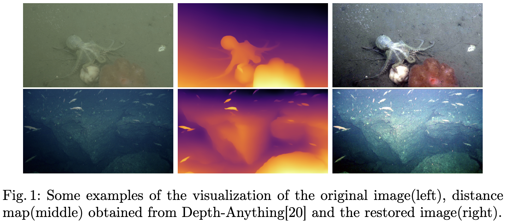
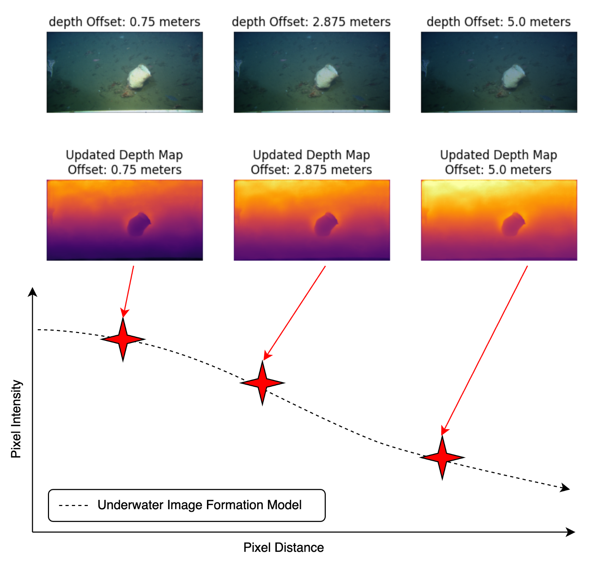
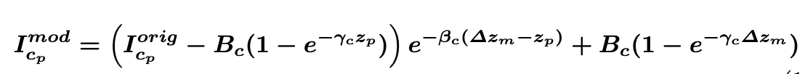

# Depth-Jitter
## Overview
Depth-Jitter is an advanced image augmentation project designed to enhance datasets by incorporating depth information. This repository provides a suite of tools for **depth-aware image processing**, **data augmentation**, and **model training**, allowing researchers to improve model robustness, particularly in depth-dependent applications such as **underwater imaging, autonomous navigation, and 3D reconstruction**.

Key features of Depth-Jitter include:
- **Depth-Based Augmentation**: Modifies image intensities based on depth information to simulate real-world conditions.
- **Quantile-Based Thresholding**: Implements a data-driven thresholding technique to adaptively process images with varying depth distributions.
- **Adaptive Depth Offsetting**: Introduces controlled variations using a randomized depth jitter technique.
- **Multi-Dataset Support**: Designed to work with multiple datasets, including UTDAC2020 and FathomNet, with optimized depth thresholds.
- **Seamless Integration**: Compatible with deep learning frameworks for model training and evaluation.

By integrating depth-aware augmentation, Depth-Jitter improves model generalization and robustness, making it highly applicable to computer vision tasks in **low-visibility environments, robotics, and depth-aware object detection**.


### Underwater Image Formation Model
<p align="center">
  
</p>

### Depth Jitter 
<p align="center">
  
</p>


## Depth Jitter Equation

To model depth-aware augmentation, we introduce the following equation:

<p align="center">
  
</p>

In this equation, \( \Delta z_m \) represents the depth offset added to the original depth map. By incorporating this offset, we generate **synthetic data with depth variations**, which serves as an effective **data augmentation strategy**. This method enhances the model’s robustness to varying **color and depth conditions**, particularly in **underwater environments** where visibility and illumination vary significantly.

By applying depth offsets during training, the model learns to generalize across different visibility settings, leading to **improved adaptability in real-world scenarios**.

## Project Structure

```
.
├── README.md
├── assets
│   ├── depth-jitter-white.png
│   ├── equation.png
│   ├── project_video.mp4
│   └── seathru.png
├── depth_variance_fathomnet.json
├── depth_variance_utdac.json
├── environment.yml
├── output-fathomnet.png
├── output-utdac.png
├── parameters_train.json
├── q2l_labeller
│   ├── __init__.py
│   ├── __pycache__
│   ├── data
│   ├── loss_modules
│   ├── models
│   └── pl_modules
├── simple-demo.ipynb
├── train.json
├── train_fathomnet.json
├── train_q2l.py
├── val.json
├── val_fathomnet.json

```
## Usage
### Create Conda Environment
```
conda env create -f environment.yml

```
### Activate Conda Environment
```
conda activate depth-jitter

```
