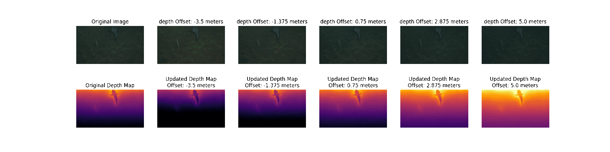

<h1 align="center">Depth-Jitter</h1>

<p align="center">
  <strong>Authors:</strong> Md Sazidur Rahman, David Cabecinhas, Ricard Marxer 
</p>

<p align="center">
  
</p>

---


## 🚀 Overview
**Depth-Jitter** is an advanced image augmentation framework that enhances datasets by incorporating **depth-aware transformations**.  
It provides a set of tools for **depth-based image processing, data augmentation, and model training**, enabling improved **model robustness** for applications such as:

- 🌊 **Underwater Imaging**  
- 🤖 **Autonomous Navigation**  
- 🏗 **3D Reconstruction & Robotics**  

### **✨ Key Features**
✅ **Depth-Based Augmentation** – Simulates real-world depth variations.  
✅ **Quantile-Based Thresholding** – Adaptive thresholding for different depth distributions.  
✅ **Adaptive Depth Offsetting** – Introduces controlled randomness for better robustness.  
✅ **Multi-Dataset Support** – Works with **UTDAC2020** and **FathomNet** datasets.  
✅ **Seamless Deep Learning Integration** – Ready for model training and evaluation.  


### Underwater Image Formation Model
<p align="center">
  
</p>

### Depth Jitter 
<p align="center">
  
</p>


## Depth Jitter Equation

To model depth-aware augmentation, we introduce the following equation:

<p align="center">
  
</p>

In this equation, \( \Delta z_m \) represents the depth offset added to the original depth map. By incorporating this offset, we generate **synthetic data with depth variations**, which serves as an effective **data augmentation strategy**. This method enhances the model’s robustness to varying **color and depth conditions**, particularly in **underwater environments** where visibility and illumination vary significantly.

By applying depth offsets during training, the model learns to generalize across different visibility settings, leading to **improved adaptability in real-world scenarios**.

## 📂 Project Structure

```
.
├── README.md
├── assets
│   ├── depth-jitter-white.png
│   ├── equation.png
│   ├── project_video.mp4
│   └── seathru.png
├── depth_variance_fathomnet.json
├── depth_variance_utdac.json
├── environment.yml
├── output-fathomnet.png
├── output-utdac.png
├── parameters_train.json
├── q2l_labeller
│   ├── __init__.py
│   ├── __pycache__
│   ├── data
│   ├── loss_modules
│   ├── models
│   └── pl_modules
├── simple-demo.ipynb
├── train.json
├── train_fathomnet.json
├── train_q2l.py
├── val.json
├── val_fathomnet.json

```
## Usage
### Clone the repository
```
git clone https://github.com/mim-team/Depth-Jitter.git
```
```
cd Depth-Jitter/
```
### Create Conda Environment
```
conda env create -f environment.yml

```
### Activate Conda Environment
```
conda activate depth-jitter

```

### train with desired dataset
```
python train_q2l.py --dataset FathomNet

```
### Jupyter Notebook

A Jupyter Notebook is provided for a more user-friendly and interactive experience with the code.  

### If you want to change augmentation settings
You can tweak the augmentation settings and the image size in this part of the training script. 
```python
# Initialize Data Module
coco = COCODataModule(
    data_dir=selected_dataset["image_folder"],
    img_size=384,
    batch_size=128,
    num_workers=8,  # Adjust based on CPU cores
    use_cutmix=True,
    cutmix_alpha=1.0,
    train_classes=None,
    sampling_strategy="default",  # oversample, undersample, default
    augmentation_strategy="seathru", # baseline, seathru, combined
    num_classes=selected_dataset["num_classes"],
    seathru_transform=seathru_transform
)
```

### Model Settings
You can change the model backbone and hyperparameters in this section of the training script. 
If you want to use different backbones you can use them from [timm](https://huggingface.co/docs/timm/en/results)

If you use a different backbone, please make sure to change the backbone_desc and conv_out_dims according to the models. 

```python

param_dict = {
    "backbone_desc": "resnest101e",
    "conv_out_dim": 2048,
    "hidden_dim": 256,
    "num_encoders": 2,
    "num_decoders": 3,
    "num_heads": 8,
    "batch_size": 128,
    "image_dim": 384,
    "learning_rate": 1e-4,
    "momentum": 0.9,
    "weight_decay": 1e-2,
    "n_classes": selected_dataset["num_classes"],  # Dynamically assign class numbers
    "thresh": 0.4,
    "use_cutmix": True,
    "use_pos_encoding": True,
    "loss": "ASL",
    "data": coco
}
```

### Inference Images
```
python inference.py --image path/to/image.jpg --checkpoint path/to/model.ckpt --num_classes <number of classes>

```
## 🏋️ Train Your Own Dataset

If you want to train your own dataset, follow these steps:

### **📌 Step 1: Generate Depth Images**
Get the **depth images** and **depth parameters** using any state-of-the-art **RGB-to-Depth** model.  
We used **[Depth Anything v2](https://github.com/DepthAnything/Depth-Anything-V2)** for our dataset.  

---

### **📌 Step 2: Extract Seathru Parameters**
Use **[Gaussian Seathru](https://github.com/clementinboittiaux/sucre/blob/vignetting/src/gaussian_seathru.py)** (from **Sucre**) to obtain **seathru parameters**.  
📌 **Note:** You will need the **depth images** from Step 1 for this process.  

---

### **📌 Step 3: Compute Depth Variance Threshold**
To determine the **depth variance threshold** and generate the `depth_variance.json` file:  
📌 Use the **[Jupyter Notebook](simple-demo.ipynb)** provided in this repository.  

---

### **📌 Step 4: Prepare Annotations in COCO Format**
Ensure that your dataset **annotations** are formatted in **COCO JSON format** before proceeding.  
📌 Refer to the [COCO Dataset Guide](https://cocodataset.org/#format-data) if needed.  

---

### **📌 Step 5: Train Your Model with Depth-Jitter**
Now that you have all the required data, you can **train your multi-label classification model**  
using our **proposed augmentation technique**! 🎯  

```sh
# Example command to train your dataset after fixing the paths in the training script.
python train.py --dataset YourDataset
```

## Acknowledgement
First and foremost, I would like to express my deepest gratitude to my supervisor, **Professor Dr. Ricard Marxer**, for his continuous support, guidance, and encouragement throughout this research. His insightful feedback and unwavering belief in my capabilities have been invaluable to the completion of this work. I am also profoundly grateful to my co-supervisor, **Dr. David Cabecinhas**, for his expertise, patience, and constructive criticism, which have significantly contributed to the quality and direction of this research. I extend my sincere thanks to the **LIS Lab** at **Université de Toulon** for providing the financial support and resources necessary for this research. The funding and facilities offered by the LIS Lab have been instrumental in facilitating my experiments and enabling me to pursue my research objectives. Additionally, I acknowledge the faculty and staff of **Université de Toulon** and **Instituto Superior Técnico** for their support and assistance during my studies. Special thanks to my colleagues and friends for providing a stimulating and supportive environment in which to learn and grow.

## 📖 Citation

If you use **Depth-Jitter** in your work, please cite:

### **📄 BibTeX**
```bibtex
@article{depth-jitter2025,
  author  = {Md Sazidur Rahman, Ricard Marxer, David Cabecinhas},
  title   = {Depth-Jitter: Depth-Based Image Augmentation for Robust Model Training},
  journal = {XX},
  year    = {2025},
  volume  = {XX},
  number  = {XX},
  pages   = {XXX-XXX},
  doi     = {10.XXXX/XXXXX},
}

